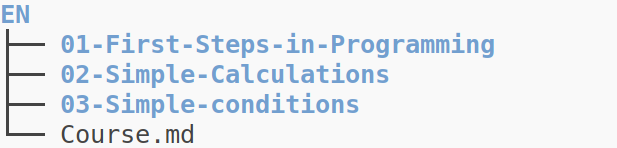
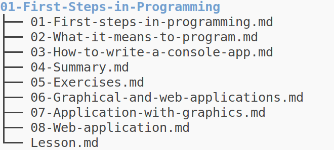
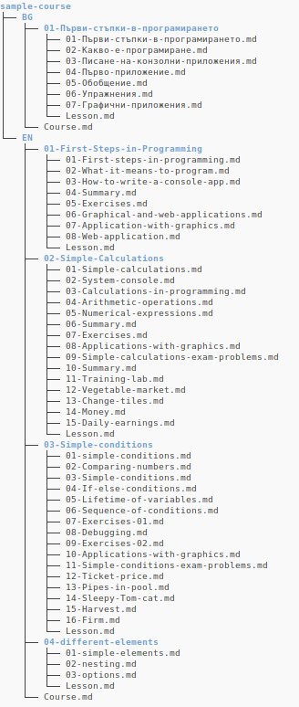

# Course Organization

Courses in interactive are build based on github repositories. i.e. each github repository can become an interactive course.

The only requirement is to follow a strict architecture:

## Course directory
The root of the repository contains one assets folder and one or many languages folders
  - The name of the assets folder should be `assets`
  - Each language folder name should be 2-letter language name
  - The contents of each language folder will contain the course in the respectful language

## Instance directory

Inside the language directory:

- A file named `Course.md` with this exact name
    - Contains the information of the course in the respectful language
        - What is the course about, trainers, etc...
- One or many folders, representing the lessons of this course
    - Each starting with a number in two-digit format
        - i.e. `01`, `02`, ..., `10`, etc...
        - not `1`, `2`, ..., `10`

## Lesson directory

Inside each lesson directory:

- A file named `Lesson.md`
    - Contains the information of the lesson in the respectful language
        - What will be covered, etc...
- One or many folders, representing the sections of this lesson
    - Each starting with a number in two-digit format
        - i.e. `01`, `02`, ..., `10`, etc...
        - not `1`, `2`, ..., `10`

## Sections

Each file into a lesson's directory starting with number represents a lesson's section. A section contains one or many slides

## Slides

Each slide is a custom [slide] element (more info [slide documentation](../custom-elements/#slides-slide))

## The whole structure

